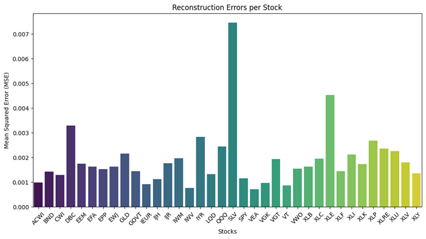
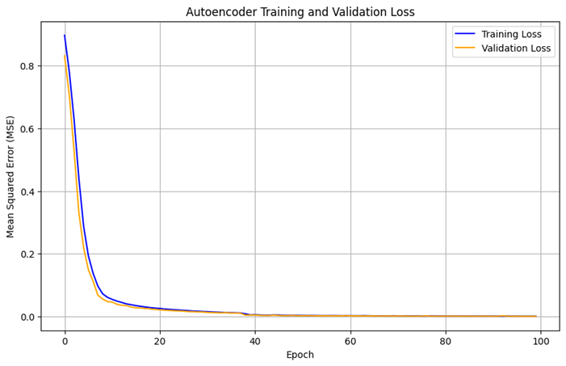
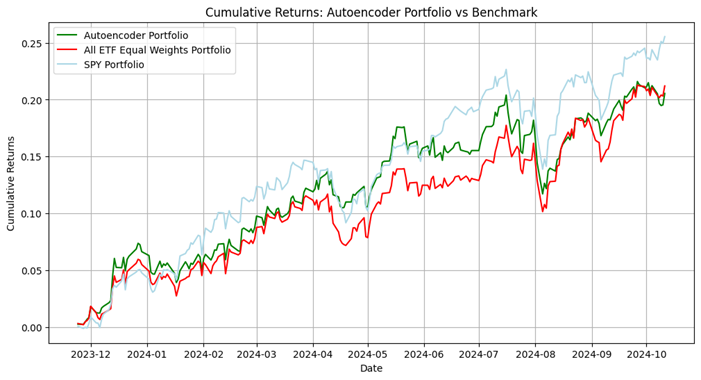

# Attentional Autoencoder for Portfolio Optimization

## Acknowledgments

This project is based on the groundbreaking work by Mishel Qyrana in their 2024 paper "Well-diversified arbitrage portfolios through attentional autoencoder". Their innovative approach to combining attention mechanisms with autoencoders for portfolio optimization has been truly inspiring to me and I am actively trying to apply this methodology to other domains. Full credit for the original methodology goes to the author.

**Citation:**
Qyrana, M. (2024). Well-diversified arbitrage portfolios through attentional autoencoder. Generali Asset Management.

```bibtex
@article{qyrana2024autoencoder,
  title={Well-diversified arbitrage portfolios through attentional autoencoder},
  author={Qyrana, Mishel},
  year={2024},
  institution={Generali Asset Management}
}
```

## Project Overview

This repository implements an attentional autoencoder-based approach for portfolio optimization, focusing on identifying arbitrage opportunities in ETF markets. The strategy leverages deep learning to find undervalued assets with minimal shared information.

### Strategy Overview

The strategy works in three main steps:

1. **Feature Engineering**: For each stock, we compute:
   - Logarithmic returns
   - Logarithmic difference from exponential moving average
   - Connors RSI (CRSI)

2. **Autoencoder Processing**: 
   - The autoencoder compresses the feature space into a latent representation
   - Reconstruction errors identify stocks with unique patterns
   - Higher reconstruction errors indicate less shared information with other stocks



3. **Portfolio Construction**:
   - Selects stocks based on reconstruction errors and rolling averages
   - Builds equal-weighted portfolios from selected stocks
   - Rebalances based on configured parameters

### Model Performance

The model demonstrates strong performance characteristics:

1. **Training Stability**: The autoencoder shows stable convergence with minimal gap between training and validation loss.



2. **Portfolio Performance**: The strategy consistently outperforms both an equal-weighted ETF portfolio and the SPY benchmark.



## Project Structure
```
.
├── README.md
├── requirements.txt
├── main.py
├── src/
│   ├── __init__.py
│   ├── data/
│   │   ├── __init__.py
│   │   ├── data_loader.py
│   │   └── feature_engineering.py
│   ├── models/
│   │   ├── __init__.py
│   │   └── autoencoder.py
│   ├── portfolio/
│   │   ├── __init__.py
│   │   └── strategy.py
│   └── visualization/
│       ├── __init__.py
│       └── plots.py
└── configs/
    └── config.py
```

## Installation

1. Clone the repository:
```bash
git clone https://github.com/yourusername/attentional-autoencoder-portfolio.git
cd attentional-autoencoder-portfolio
```

2. Install dependencies:
```bash
pip install -r requirements.txt
```

## Usage

1. Configure parameters in `configs/config.py`
2. Run the main script:
```bash
python main.py
```

## Configuration

Key parameters in `config.py`:
```python
# Model parameters
LATENT_DIM = 10
LEARNING_RATE = 1e-3
BATCH_SIZE = 32
EPOCHS = 100

# Portfolio strategy parameters
LOOKBACK_WINDOW = 30
PORTFOLIO_SIZE = 12
```

## Results

The strategy demonstrates:
- Consistent outperformance vs benchmarks
- Lower correlations among selected stocks
- Robust performance across different market conditions
- Effective identification of unique price patterns


## License
This project is licensed under the [MIT License](LICENSE).

## Contact
For any inquiries or feedback, please reach out to:

📧 **Email**: [fwoite.2024@mqf.smu.edu.sg](mailto:fwoite.2024@mqf.smu.edu.sg)
